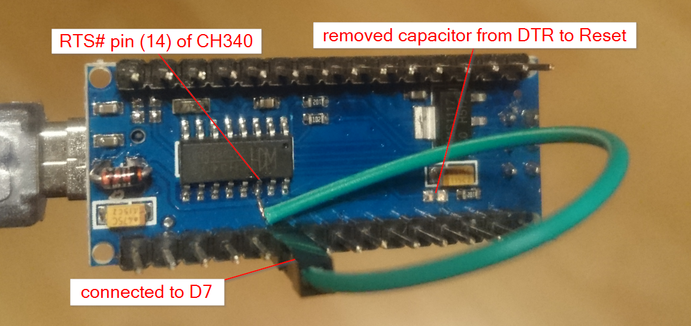

# serialMouseEmulator
Schematic and Arduino code for building your Serial mouse emulator. This can be
used to emulate a serial mouse to control your PC. The emulation can be triggered
by external buttons or other sensors. This implementation do just move the mouse
around a little bit.

The this circuit emulates a 3 button Microsoft serial mouse. Drivers that don't support
the 3 button version will only be able to register 2 buttons. Scrollwheel is not
supported for this mouse type.

This project was prototyped using an Arduino Nano from Aliexpress. But it should work
with any 5v Arduino with a built-in serial UART to USB converter chip. The emulator
worked but was a little bit choppy. But to just have a mouse movement without any
requirements for accuracy it is fine.

## Requirements
* Easiest with Arduino Nano with CH340 USART-USB adapter chip.

## Adaptations to the Arduino
* Connect RTS pin of CH340 to configured pin (D7)
* Remove capacitor connecting DTR to Reset pin

## Features
* Microsoft 3-button mouse compatible (Logitech also supported).
* ~40 reports per second event rate (when not holding down the middle button).
* Easy to configure Arduino sketch code to suit your build.

## Disclaimer
As with all DIY electronics projects, this project comes with absolutely no
warranty and will not liable for any loss or damage caused to your Arduino
or vintage PC you used this adapter on. Use at your own risk!
